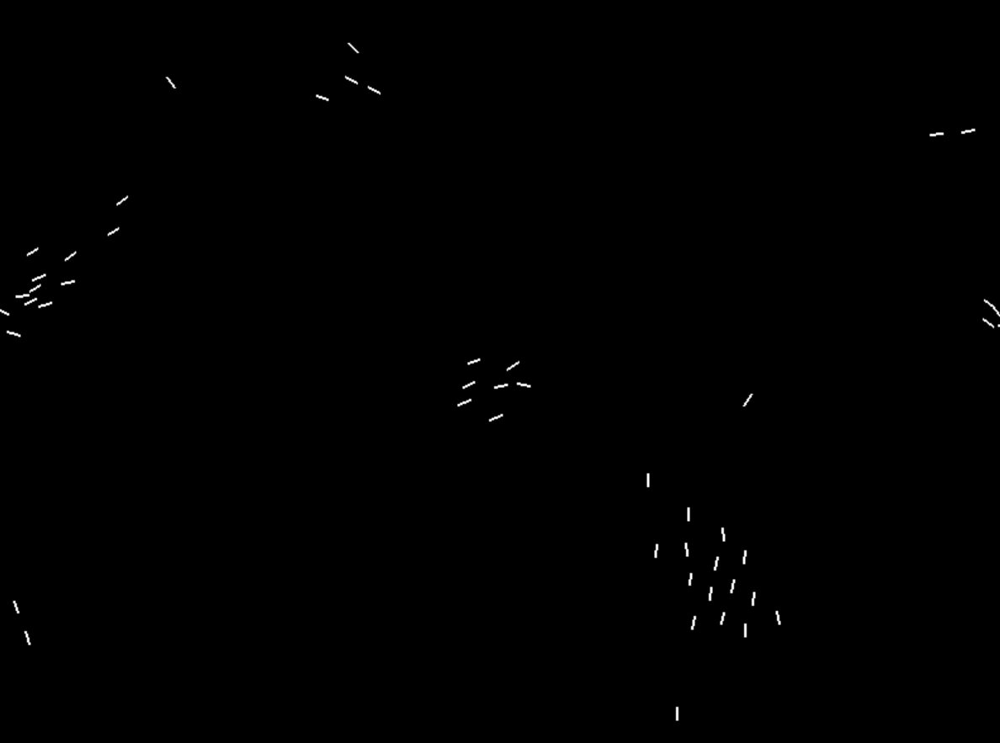

# Pygame Boids Simulaton

This is a pygame simulation that simulated boids.



## Table of Contents

- [Installation](#installation)
- [Usage](#usage)
- [What is boids?](#what-is-boids)
- [Credits](#credits)
- [Licence](#licence)

## Installation 

First, clone the Github repository with this command:
```
git clone https://github.com/DarkTwentyFive/Pygame-Boids-Simulation.git
```

Then, install the dependencies with:
```
pip install -r requirements.txt
```

## Usage

Then, enter the code directory with:
```
cd Pygame-Boids-Simulation
```

Finally, run the code with:
```
python main.py
```

You will then receive an input to enter a word or phrase, enter it in and you will receive the predicted next word.

## What is boids?

Boids is an artificial life program, developed by Craig Reynolds in 1986, which simulates the flocking behaviour of birds, and related group motion.

The rules applied in the simplest Boids world are as follows:
- separation: steer to avoid crowding local flockmates.
- alignment: steer towards the average heading of local flockmates.
- cohesion: steer to move towards the average position (center of mass) of local flockmates.

The aim of the simulation was to replicate the behavior of flocks of birds. Instead of controlling the interactions of an entire flock, however, the Boids simulation only specifies the behavior of each individual bird.

## Credits

Developed by Ruben Roy.

## License

This boids simulation is open-source and is under the MIT License. See the [LICENSE](LICENSE) for more information.
